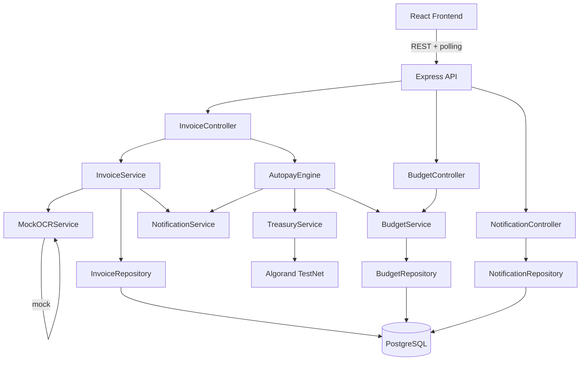
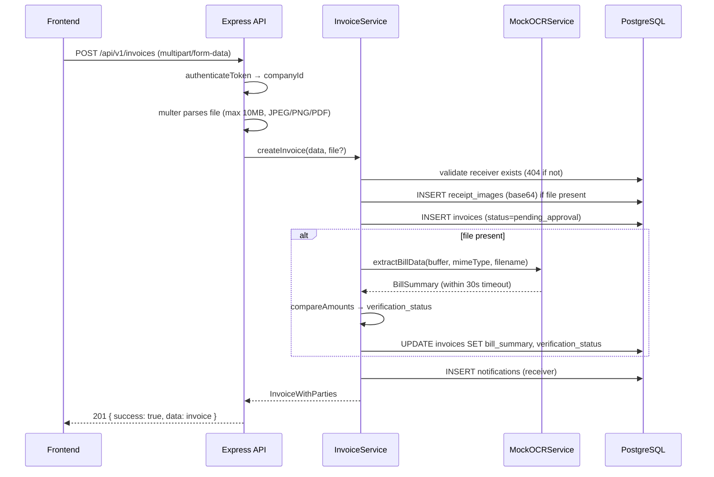
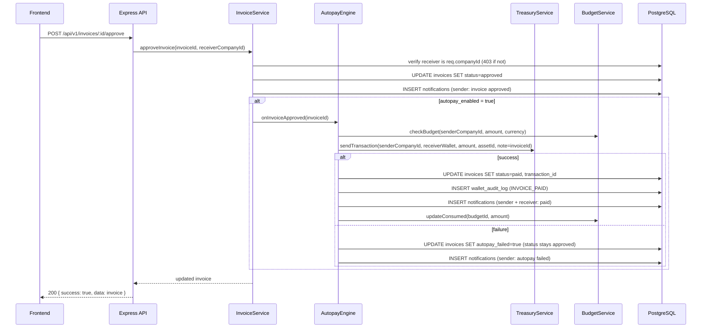
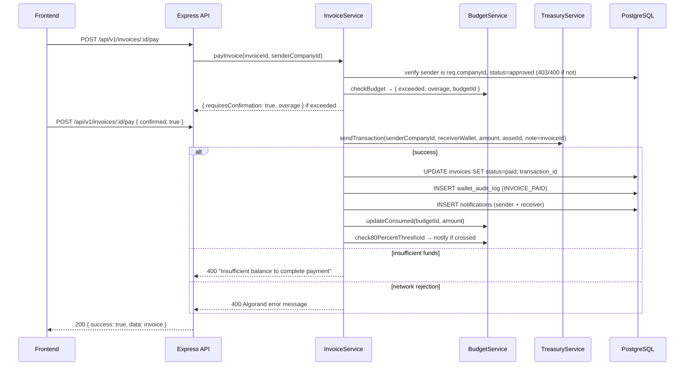

# Design Document: Smart Invoice & Payment System

## Overview

The Smart Invoice & Payment system replaces the existing basic invoice CRUD with a full B2B payment workflow on Algorand TestNet. It introduces a sender/receiver model where registered Trezo companies issue structured payment requests to each other, attach receipt images, have an AI agent verify bill details, require receiver approval, and execute on-chain ALGO/ASA payments directly from the dashboard. Autopay rules, budget enforcement, and in-app notifications complete the workflow.

The system is built on the existing Node.js + Express + TypeScript backend with PostgreSQL (Neon), integrating with the existing `TreasuryService.sendTransaction()`, AWS KMS key decryption, and `algodClient`/`indexerClient` from `src/config/algorand.ts`. The existing `invoices` table is dropped and replaced entirely.

---

## Architecture

The feature follows the existing layered architecture: routes → controllers → services → repositories → database. New layers introduced are a mock OCR service (swappable interface), an autopay engine (event-driven, triggered on status transition), and a notification service (DB-backed, polled every 10s from frontend).



### Key Design Decisions

- **Mock OCR with clean interface**: `IOCRService` interface with `extractBillData(buffer, mimeType)` method. `MockOCRService` implements rule-based extraction from filename/metadata patterns. Real Bedrock/Textract can be swapped in by implementing the interface.
- **Autopay as a post-transition hook**: `AutopayEngine.onInvoiceApproved(invoiceId)` is called synchronously within the approval transaction. If autopay fails, the invoice remains `approved` with `autopay_failed=true`.
- **Base64 storage for receipts**: Files stored as base64 in a `receipt_images` table (separate from invoices to keep invoice rows lean). The invoice stores a `receipt_image_id` FK.
- **Budget check as a soft gate**: Budget overage shows a warning and requires confirmation; it does not hard-block payment. This matches the requirements (Req 8.3).
- **Polling for real-time updates**: Frontend polls `/api/v1/invoices/inbox` and `/api/v1/notifications` every 10s, satisfying the 5-second update window (Req 9.5) with acceptable latency for TestNet.

---

## Components and Interfaces

### Backend Components

**InvoiceController** (`src/controllers/invoiceController.ts` — full replacement)

- `POST /api/v1/invoices` — create invoice (with optional file upload via multer)
- `GET /api/v1/invoices/inbox` — unified inbox (sent + received, filterable)
- `GET /api/v1/invoices/:id` — get single invoice
- `POST /api/v1/invoices/:id/approve` — receiver approves
- `POST /api/v1/invoices/:id/reject` — receiver rejects (requires reason)
- `POST /api/v1/invoices/:id/cancel` — sender cancels
- `POST /api/v1/invoices/:id/pay` — sender pays (manual)
- `GET /api/v1/invoices/summary` — dashboard summary cards

**BudgetController** (`src/controllers/budgetController.ts` — new)

- `POST /api/v1/budgets` — create budget
- `GET /api/v1/budgets` — list company budgets
- `GET /api/v1/budgets/:id` — get budget with utilisation
- `PUT /api/v1/budgets/:id` — update budget
- `DELETE /api/v1/budgets/:id` — delete budget

**NotificationController** (`src/controllers/notificationController.ts` — new)

- `GET /api/v1/notifications` — list last 50 notifications
- `POST /api/v1/notifications/:id/read` — mark as read
- `POST /api/v1/notifications/read-all` — mark all as read
- `GET /api/v1/notifications/unread-count` — unread count

**CompanyController** (addition to existing)

- `GET /api/v1/companies/search?q=` — company name search (min 2 chars)

### Service Interfaces

```typescript
// IOCRService — clean interface for swappable OCR
interface IOCRService {
  extractBillData(buffer: Buffer, mimeType: string, filename: string): Promise<BillSummary>;
}

interface BillSummary {
  vendorName: string | null;
  lineItems: Array<{ description: string; amount: string }>;
  subtotal: string | null;
  tax: string | null;
  total: string | null;
  extractedAt: string; // ISO timestamp
}

// AutopayEngine — triggered on approval
interface IAutopayEngine {
  onInvoiceApproved(invoiceId: number): Promise<void>;
}

// NotificationService
interface INotificationService {
  deliver(companyId: number, type: NotificationType, payload: NotificationPayload): Promise<void>;
}
```

### Frontend Components

New components under `src/components/invoices/`:

- `InvoicePage.tsx` — top-level page with tab navigation (Inbox / Budgets)
- `InvoiceInbox.tsx` — unified list with filter bar, status badges, polling
- `InvoiceCard.tsx` — single invoice row with counterparty, amount, status, verification badge
- `InvoiceDetailModal.tsx` — full invoice view with receipt image preview, AI summary, action buttons
- `CreateInvoiceModal.tsx` — multi-step form: recipient search → amount/currency → receipt upload → autopay toggle
- `CompanySearchInput.tsx` — debounced search input with dropdown results
- `CurrencySelector.tsx` — wallet asset picker with balance display and opt-in warning
- `ReceiptUpload.tsx` — drag-and-drop file upload with preview
- `BudgetPanel.tsx` — budget CRUD and utilisation bars
- `BudgetWarningModal.tsx` — overage confirmation dialog
- `NotificationBell.tsx` — nav icon with unread badge, dropdown list (replaces/extends existing)

Additions to existing components:

- `TreasuryDashboard.tsx` — add invoice summary cards (payables, receivables, paid this month, pending approvals)

---

## Data Models

### Database Schema (Migration)

```sql
-- Drop old invoices table
DROP TABLE IF EXISTS invoices CASCADE;

-- Receipt images stored separately (base64 in DB for TestNet simplicity)
CREATE TABLE receipt_images (
    id SERIAL PRIMARY KEY,
    company_id INT NOT NULL,
    filename VARCHAR(255) NOT NULL,
    mime_type VARCHAR(50) NOT NULL,
    size_bytes INT NOT NULL,
    data TEXT NOT NULL,  -- base64-encoded file content
    created_at TIMESTAMPTZ DEFAULT NOW(),
    CONSTRAINT fk_receipt_company FOREIGN KEY (company_id) REFERENCES companies(id) ON DELETE CASCADE
);

-- New invoices table
CREATE TABLE invoices (
    id SERIAL PRIMARY KEY,
    sender_company_id INT NOT NULL,
    receiver_company_id INT NOT NULL,
    amount NUMERIC(30, 6) NOT NULL,       -- stored as decimal, serialised as string in API
    currency VARCHAR(20) NOT NULL DEFAULT 'ALGO',
    asset_id BIGINT,                       -- NULL for ALGO, ASA ID otherwise
    message TEXT NOT NULL,
    status VARCHAR(30) NOT NULL DEFAULT 'draft'
        CHECK (status IN ('draft','pending_approval','approved','rejected','paid','cancelled')),
    autopay_enabled BOOLEAN NOT NULL DEFAULT FALSE,
    autopay_failed BOOLEAN NOT NULL DEFAULT FALSE,
    rejection_reason TEXT,
    transaction_id VARCHAR(255),           -- Algorand txID after payment
    receipt_image_id INT,                  -- FK to receipt_images
    bill_summary JSONB,                    -- AI-extracted BillSummary
    verification_status VARCHAR(20) NOT NULL DEFAULT 'not_applicable'
        CHECK (verification_status IN ('not_applicable','matched','mismatch','unverifiable','timeout','pending')),
    created_at TIMESTAMPTZ DEFAULT NOW(),
    updated_at TIMESTAMPTZ DEFAULT NOW(),
    CONSTRAINT fk_sender FOREIGN KEY (sender_company_id) REFERENCES companies(id) ON DELETE CASCADE,
    CONSTRAINT fk_receiver FOREIGN KEY (receiver_company_id) REFERENCES companies(id) ON DELETE CASCADE,
    CONSTRAINT fk_receipt FOREIGN KEY (receipt_image_id) REFERENCES receipt_images(id) ON DELETE SET NULL,
    CONSTRAINT chk_different_companies CHECK (sender_company_id <> receiver_company_id),
    CONSTRAINT chk_positive_amount CHECK (amount > 0)
);

-- Budgets
CREATE TABLE budgets (
    id SERIAL PRIMARY KEY,
    company_id INT NOT NULL,
    name VARCHAR(255) NOT NULL,
    currency VARCHAR(20) NOT NULL,
    asset_id BIGINT,
    limit_amount NUMERIC(30, 6) NOT NULL,
    period VARCHAR(20) NOT NULL CHECK (period IN ('monthly', 'quarterly')),
    consumed_amount NUMERIC(30, 6) NOT NULL DEFAULT 0,
    period_start DATE NOT NULL,            -- start of current period
    is_active BOOLEAN NOT NULL DEFAULT TRUE,
    created_at TIMESTAMPTZ DEFAULT NOW(),
    updated_at TIMESTAMPTZ DEFAULT NOW(),
    CONSTRAINT fk_budget_company FOREIGN KEY (company_id) REFERENCES companies(id) ON DELETE CASCADE
);

-- Notifications
CREATE TABLE notifications (
    id SERIAL PRIMARY KEY,
    company_id INT NOT NULL,
    type VARCHAR(50) NOT NULL,
    title VARCHAR(255) NOT NULL,
    body TEXT NOT NULL,
    invoice_id INT,
    is_read BOOLEAN NOT NULL DEFAULT FALSE,
    created_at TIMESTAMPTZ DEFAULT NOW(),
    CONSTRAINT fk_notif_company FOREIGN KEY (company_id) REFERENCES companies(id) ON DELETE CASCADE,
    CONSTRAINT fk_notif_invoice FOREIGN KEY (invoice_id) REFERENCES invoices(id) ON DELETE SET NULL
);

-- Indexes
CREATE INDEX idx_invoices_sender ON invoices(sender_company_id);
CREATE INDEX idx_invoices_receiver ON invoices(receiver_company_id);
CREATE INDEX idx_invoices_status ON invoices(status);
CREATE INDEX idx_invoices_created_at ON invoices(created_at DESC);
CREATE INDEX idx_budgets_company ON budgets(company_id);
CREATE INDEX idx_notifications_company ON notifications(company_id);
CREATE INDEX idx_notifications_unread ON notifications(company_id, is_read) WHERE is_read = FALSE;
```

### TypeScript Types

```typescript
// Invoice lifecycle status
type InvoiceStatus = "draft" | "pending_approval" | "approved" | "rejected" | "paid" | "cancelled";
type VerificationStatus = "not_applicable" | "matched" | "mismatch" | "unverifiable" | "timeout" | "pending";

interface Invoice {
  id: number;
  sender_company_id: number;
  receiver_company_id: number;
  amount: string; // serialised as string for precision
  currency: string;
  asset_id: number | null;
  message: string;
  status: InvoiceStatus;
  autopay_enabled: boolean;
  autopay_failed: boolean;
  rejection_reason: string | null;
  transaction_id: string | null;
  receipt_image_id: number | null;
  bill_summary: BillSummary | null;
  verification_status: VerificationStatus;
  created_at: string;
  updated_at: string;
}

// API response enriches with company names
interface InvoiceWithParties extends Invoice {
  sender_company_name: string;
  receiver_company_name: string;
}

interface Budget {
  id: number;
  company_id: number;
  name: string;
  currency: string;
  asset_id: number | null;
  limit_amount: string;
  period: "monthly" | "quarterly";
  consumed_amount: string;
  period_start: string;
  is_active: boolean;
}

interface Notification {
  id: number;
  company_id: number;
  type: string;
  title: string;
  body: string;
  invoice_id: number | null;
  is_read: boolean;
  created_at: string;
}
```

---

## Key Workflow Data Flows

### Invoice Creation Flow



### Approval + Autopay Flow



### Manual Payment Flow



---

## File Upload Handling

Multer is configured as middleware on the invoice creation route only:

```typescript
const upload = multer({
  storage: multer.memoryStorage(),
  limits: { fileSize: 10 * 1024 * 1024 }, // 10 MB
  fileFilter: (req, file, cb) => {
    const allowed = ["image/jpeg", "image/png", "application/pdf"];
    if (allowed.includes(file.mimetype)) cb(null, true);
    else cb(new Error("Only JPEG, PNG, and PDF files are accepted"));
  },
});
```

The file buffer is converted to base64 and stored in `receipt_images.data`. The invoice stores only the `receipt_image_id`. When the frontend requests an invoice, the API returns a `receipt_image_url` field pointing to `GET /api/v1/invoices/:id/receipt` which streams the base64 back as the original MIME type.

---

## AI Agent Design (Mock OCR Service)

The `MockOCRService` implements `IOCRService` with rule-based extraction from filename and buffer metadata. This provides a realistic interface for future swap-in of AWS Bedrock Claude or Textract.

```typescript
class MockOCRService implements IOCRService {
  async extractBillData(buffer: Buffer, mimeType: string, filename: string): Promise<BillSummary> {
    // Rule-based extraction from filename patterns:
    // e.g. "invoice_vendor-acme_total-150.50_tax-12.50.pdf"
    // Regex patterns extract: vendor, total, tax, subtotal
    // For images: parse EXIF metadata description field if present
    // Returns BillSummary with null fields for unextractable values
  }
}
```

The service is injected into `InvoiceService` via constructor (or a module-level singleton), making it trivially replaceable:

```typescript
// To swap in real OCR:
// import { BedrockOCRService } from './bedrockOCRService';
// const ocrService: IOCRService = new BedrockOCRService();
const ocrService: IOCRService = new MockOCRService();
```

A 30-second timeout wraps the OCR call using `Promise.race`:

```typescript
const ocrResult = await Promise.race([
  ocrService.extractBillData(buffer, mimeType, filename),
  new Promise<BillSummary>((_, reject) => setTimeout(() => reject(new Error("OCR_TIMEOUT")), 30000)),
]);
```

On timeout, `verification_status` is set to `timeout` and invoice submission proceeds normally.

**Amount Verification Logic:**

```typescript
function computeVerificationStatus(declared: string, extracted: string | null): VerificationStatus {
  if (!extracted) return "unverifiable";
  const diff = Math.abs(parseFloat(declared) - parseFloat(extracted));
  const tolerance = parseFloat(declared) * 0.01; // 1% tolerance for rounding
  return diff <= tolerance ? "matched" : "mismatch";
}
```

---

## Autopay Engine Design

`AutopayEngine` is a stateless service called synchronously within the approval flow. It does not use a job queue for TestNet simplicity — the approval HTTP request waits for the autopay attempt to complete (or fail) before responding.

```typescript
class AutopayEngine {
  static async onInvoiceApproved(invoiceId: number): Promise<void> {
    const invoice = await InvoiceRepository.findById(invoiceId);
    if (!invoice?.autopay_enabled) return;

    try {
      const receiverWallet = await CompanyRepository.getWalletAddress(invoice.receiver_company_id);
      const txId = await TreasuryService.sendTransaction({
        companyId: invoice.sender_company_id,
        receiverAddress: receiverWallet,
        amount: parseFloat(invoice.amount),
        assetId: invoice.asset_id ?? undefined,
        note: `TREZO_INVOICE_${invoiceId}`,
      });
      await InvoiceRepository.markPaid(invoiceId, txId);
      await BudgetService.recordPayment(invoice.sender_company_id, invoice.amount, invoice.currency);
      await NotificationService.deliver(invoice.sender_company_id, "AUTOPAY_SUCCESS", { invoiceId, txId });
      await NotificationService.deliver(invoice.receiver_company_id, "INVOICE_PAID", { invoiceId, txId });
    } catch (err) {
      await InvoiceRepository.setAutopayFailed(invoiceId, (err as Error).message);
      await NotificationService.deliver(invoice.sender_company_id, "AUTOPAY_FAILED", {
        invoiceId,
        reason: (err as Error).message,
      });
    }
  }
}
```

---

## Budget Enforcement Design

Budget periods are computed at check time — no cron job needed:

```typescript
function getPeriodStart(period: "monthly" | "quarterly"): Date {
  const now = new Date();
  if (period === "monthly") return new Date(now.getFullYear(), now.getMonth(), 1);
  const quarter = Math.floor(now.getMonth() / 3);
  return new Date(now.getFullYear(), quarter * 3, 1);
}
```

When a new period starts, `consumed_amount` is reset to 0 and `period_start` is updated on the first payment of the new period (lazy reset). The budget check returns:

```typescript
interface BudgetCheckResult {
  budgetId: number | null; // null if no active budget for this currency
  exceeded: boolean;
  currentConsumed: string;
  limit: string;
  overage: string; // how much over the limit this payment would put them
}
```

The 80% threshold notification is checked after every successful payment:

```typescript
if (newConsumed / limit >= 0.8 && previousConsumed / limit < 0.8) {
  await NotificationService.deliver(companyId, "BUDGET_80_PERCENT", { budgetId, currency, period });
}
```

---

## Notification System Design

Notifications are written to the `notifications` table by `NotificationService.deliver()` and read by polling from the frontend every 10 seconds.

Notification types:

- `INVOICE_RECEIVED` — delivered to receiver on new invoice
- `INVOICE_APPROVED` — delivered to sender on approval
- `INVOICE_REJECTED` — delivered to sender on rejection (includes reason)
- `INVOICE_PAID` — delivered to both sender and receiver on payment
- `AUTOPAY_SUCCESS` — delivered to sender on successful autopay
- `AUTOPAY_FAILED` — delivered to sender on autopay failure
- `BUDGET_80_PERCENT` — delivered to company when budget hits 80%

The frontend `NotificationBell` component polls `GET /api/v1/notifications/unread-count` every 10s and `GET /api/v1/notifications` on bell click. The `InvoiceInbox` component polls `GET /api/v1/invoices/inbox` every 10s to reflect status changes within the 5-second window requirement.

---

## API Endpoint Specifications

### Invoice Endpoints

| Method | Path                           | Auth | Description                                   |
| ------ | ------------------------------ | ---- | --------------------------------------------- |
| POST   | `/api/v1/invoices`             | JWT  | Create invoice (multipart/form-data)          |
| GET    | `/api/v1/invoices/inbox`       | JWT  | Unified inbox with filters                    |
| GET    | `/api/v1/invoices/summary`     | JWT  | Dashboard summary cards                       |
| GET    | `/api/v1/invoices/:id`         | JWT  | Get invoice detail                            |
| GET    | `/api/v1/invoices/:id/receipt` | JWT  | Stream receipt image                          |
| POST   | `/api/v1/invoices/:id/approve` | JWT  | Receiver approves                             |
| POST   | `/api/v1/invoices/:id/reject`  | JWT  | Receiver rejects (body: `{ reason }`)         |
| POST   | `/api/v1/invoices/:id/cancel`  | JWT  | Sender cancels                                |
| POST   | `/api/v1/invoices/:id/pay`     | JWT  | Sender pays (body: `{ confirmed?: boolean }`) |

**GET /api/v1/invoices/inbox query params:**

- `status` — filter by status
- `direction` — `sent` | `received`
- `currency` — filter by currency
- `page`, `limit` — pagination (default limit 20)

**POST /api/v1/invoices request body (multipart/form-data):**

```
receiver_company_id: number
amount: string          (serialised as string)
currency: string
asset_id?: number
message: string
autopay_enabled?: boolean
receipt?: File          (JPEG/PNG/PDF, max 10MB)
```

**GET /api/v1/invoices/summary response:**

```json
{
  "total_payables": "1500.000000",
  "total_receivables": "3200.000000",
  "paid_this_month": "800.000000",
  "pending_approval_count": 4
}
```

### Budget Endpoints

| Method | Path                  | Auth | Description                   |
| ------ | --------------------- | ---- | ----------------------------- |
| POST   | `/api/v1/budgets`     | JWT  | Create budget                 |
| GET    | `/api/v1/budgets`     | JWT  | List budgets with utilisation |
| GET    | `/api/v1/budgets/:id` | JWT  | Get single budget             |
| PUT    | `/api/v1/budgets/:id` | JWT  | Update budget                 |
| DELETE | `/api/v1/budgets/:id` | JWT  | Delete budget                 |

### Notification Endpoints

| Method | Path                                 | Auth | Description           |
| ------ | ------------------------------------ | ---- | --------------------- |
| GET    | `/api/v1/notifications`              | JWT  | Last 50 notifications |
| GET    | `/api/v1/notifications/unread-count` | JWT  | `{ count: number }`   |
| POST   | `/api/v1/notifications/:id/read`     | JWT  | Mark single as read   |
| POST   | `/api/v1/notifications/read-all`     | JWT  | Mark all as read      |

### Company Search Endpoint

| Method | Path                          | Auth | Description                            |
| ------ | ----------------------------- | ---- | -------------------------------------- |
| GET    | `/api/v1/companies/search?q=` | JWT  | Search companies by name (min 2 chars) |

Response: `[{ id: number, company_name: string, wallet_address: string }]`
(excludes the requesting company from results)

---

## Error Handling

| Scenario                           | HTTP Status | Message                                                            |
| ---------------------------------- | ----------- | ------------------------------------------------------------------ |
| Recipient company not found        | 404         | "Recipient company not found"                                      |
| Amount ≤ 0                         | 400         | "Amount must be greater than zero"                                 |
| Self-invoice attempt               | 400         | "Cannot create invoice addressed to your own company"              |
| Missing required fields            | 400         | "recipient_company_id, amount, currency, and message are required" |
| File too large                     | 400         | "File size must not exceed 10 MB"                                  |
| Unsupported file type              | 400         | "Only JPEG, PNG, and PDF files are accepted"                       |
| Insufficient ASA balance           | 400         | "Insufficient asset balance"                                       |
| Rejection reason too short         | 400         | "Rejection reason must be at least 10 characters"                  |
| Sender tries to approve/reject     | 403         | "Only the recipient can approve or reject an invoice"              |
| Receiver tries to pay              | 403         | "Only the sender can pay an invoice"                               |
| Unauthorised invoice access        | 403         | "Access denied"                                                    |
| Payment on non-approved invoice    | 400         | "Invoice must be in approved status to pay"                        |
| Insufficient ALGO/ASA for payment  | 400         | "Insufficient balance to complete payment"                         |
| Algorand network rejection         | 400         | Algorand error message (passed through)                            |
| Rate limit exceeded                | 429         | "Rate limit exceeded: 20 invoices per minute"                      |
| Missing required DB fields on read | 500         | "Internal server error" (anomaly logged)                           |

Rate limiting uses an in-memory sliding window counter per `companyId` (20 requests/60s window), implemented as Express middleware on the invoice creation route.

---

## Correctness Properties

_A property is a characteristic or behavior that should hold true across all valid executions of a system — essentially, a formal statement about what the system should do. Properties serve as the bridge between human-readable specifications and machine-verifiable correctness guarantees._

### Property 1: Company search excludes self

_For any_ authenticated company, a search query against the companies endpoint should never return the requesting company in the results, regardless of whether the company name matches the query string.

**Validates: Requirements 1.3**

---

### Property 2: Invoice creation rejects non-positive amounts

_For any_ invoice creation request where the amount is less than or equal to zero, the system should reject the request with a 400 error, and no invoice record should be created in the database.

**Validates: Requirements 1.6**

---

### Property 3: Invoice creation rejects missing required fields

_For any_ combination of missing required fields (recipient_company_id, amount, currency, message), submitting an invoice creation request should be rejected with a 400 error.

**Validates: Requirements 1.5**

---

### Property 4: Currency options always include ALGO and only positive-balance assets

_For any_ wallet balance response from Algorand, the currency options presented to the user should always include ALGO and should only include ASAs whose balance is strictly greater than zero.

**Validates: Requirements 2.1, 2.2**

---

### Property 5: ASA display contains required fields

_For any_ ASA held by the sender's wallet, when that ASA is selected as currency, the rendered option should contain the asset name, unit name, and asset ID.

**Validates: Requirements 2.3**

---

### Property 6: File upload validation rejects invalid files

_For any_ file upload where either the MIME type is not JPEG/PNG/PDF or the file size exceeds 10 MB, the upload should be rejected with a 400 error and no receipt image record should be created.

**Validates: Requirements 3.1, 3.2, 3.3**

---

### Property 7: Receipt image round-trip

_For any_ valid receipt file uploaded with an invoice, retrieving the invoice and then fetching the receipt endpoint should return a response with the same MIME type and equivalent binary content as the original upload.

**Validates: Requirements 3.4**

---

### Property 8: AI agent output schema completeness

_For any_ input to the MockOCRService (any buffer, any MIME type, any filename), the returned BillSummary object should always contain all required fields (vendorName, lineItems, subtotal, tax, total, extractedAt), even if their values are null.

**Validates: Requirements 4.1**

---

### Property 9: Verification status is deterministic

_For any_ pair of (declared_amount, extracted_total), the `computeVerificationStatus` function should return `matched` if the values are within 1% tolerance, `mismatch` if they differ beyond tolerance, and `unverifiable` if extracted_total is null. The same inputs always produce the same output.

**Validates: Requirements 4.3, 4.5**

---

### Property 10: No-receipt invoices get not_applicable verification status

_For any_ invoice submitted without a receipt image, the stored `verification_status` should be `not_applicable` and `bill_summary` should be null.

**Validates: Requirements 4.6**

---

### Property 11: Invoice submission sets pending_approval status

_For any_ valid invoice creation request, the resulting invoice record should have status `pending_approval` and a corresponding notification should exist for the receiver company.

**Validates: Requirements 5.1, 10.1**

---

### Property 12: Approval and rejection are receiver-only operations

_For any_ invoice, if the requesting company ID matches the sender_company_id, then calling approve or reject should return a 403 error and the invoice status should remain unchanged.

**Validates: Requirements 5.3, 5.4, 12.3**

---

### Property 13: Rejection requires minimum reason length

_For any_ rejection request where the reason string has fewer than 10 characters (after trimming), the system should reject the request with a 400 error and the invoice status should remain `pending_approval`.

**Validates: Requirements 5.4**

---

### Property 14: Rejected invoice status is terminal (except cancelled)

_For any_ invoice with status `rejected`, attempting to transition it to any status other than `cancelled` should return an error and the status should remain `rejected`.

**Validates: Requirements 5.5**

---

### Property 15: Inbox filter correctness

_For any_ set of invoices and any filter combination (status, direction, currency), all invoices returned by the inbox endpoint should satisfy every applied filter criterion, and no invoice satisfying all criteria should be omitted.

**Validates: Requirements 5.7, 9.1, 9.2**

---

### Property 16: Payment is sender-only and requires approved status

_For any_ invoice, if the requesting company ID matches the receiver_company_id, calling pay should return a 403 error. Additionally, for any invoice not in `approved` status, calling pay should return an error and the status should remain unchanged.

**Validates: Requirements 6.1, 12.4**

---

### Property 17: Successful payment transitions to paid with audit log entry

_For any_ approved invoice where the on-chain transaction succeeds, the resulting invoice should have status `paid`, a non-null `transaction_id`, and a corresponding `INVOICE_PAID` entry in `wallet_audit_log`.

**Validates: Requirements 6.3, 6.6**

---

### Property 18: Payment failure preserves approved status

_For any_ approved invoice where the on-chain transaction fails (insufficient funds or network rejection), the invoice status should remain `approved` and no `transaction_id` should be stored.

**Validates: Requirements 6.4, 6.5**

---

### Property 19: Transaction note contains invoice ID

_For any_ invoice payment (manual or autopay), the Algorand transaction note field should contain the invoice ID in the format `TREZO_INVOICE_{id}`.

**Validates: Requirements 6.7**

---

### Property 20: Autopay triggers on approval when enabled

_For any_ invoice with `autopay_enabled = true` that transitions to `approved` status, the autopay engine should attempt payment automatically, and the invoice should end up in either `paid` status (on success) or `approved` with `autopay_failed = true` (on failure).

**Validates: Requirements 7.2, 7.4**

---

### Property 21: Disabling autopay before approval prevents automatic payment

_For any_ invoice where autopay is disabled before the invoice reaches `approved` status, transitioning the invoice to `approved` should not trigger automatic payment.

**Validates: Requirements 7.5**

---

### Property 22: Budget consumed amount increases by payment amount

_For any_ completed payment against an active budget, the budget's `consumed_amount` after payment should equal the `consumed_amount` before payment plus the payment amount.

**Validates: Requirements 8.4**

---

### Property 23: Budget 80% threshold triggers notification exactly once per crossing

_For any_ budget, a `BUDGET_80_PERCENT` notification should be delivered if and only if the consumed amount crosses from below 80% to at or above 80% of the limit as a result of a payment.

**Validates: Requirements 8.5**

---

### Property 24: Invoice serialisation round-trip

_For any_ valid Invoice object, serialising it to JSON and then deserialising the JSON back into an Invoice object should produce an object equivalent to the original, with all fields preserved including amount as a string.

**Validates: Requirements 11.1, 11.2, 11.3**

---

### Property 25: Access control — only sender or receiver can view an invoice

_For any_ invoice and any company that is neither the sender nor the receiver, requesting that invoice by ID should return a 403 error.

**Validates: Requirements 12.2**

---

### Property 26: Unauthenticated requests are rejected

_For any_ invoice API endpoint called without a valid JWT token, the system should return a 401 error before processing the request.

**Validates: Requirements 12.1**

---

### Property 27: Rate limiting enforces 20 invoices per company per minute

_For any_ company that submits more than 20 invoice creation requests within a 60-second window, the requests beyond the 20th should receive a 429 error, and no invoice records should be created for those excess requests.

**Validates: Requirements 12.5**

---

### Property 28: Notification unread count equals count of unread notifications

_For any_ company, the value returned by `GET /api/v1/notifications/unread-count` should equal the number of notification records for that company where `is_read = false`.

**Validates: Requirements 10.3**

---

### Property 29: Marking a notification read decrements unread count by one

_For any_ unread notification, marking it as read should result in the unread count decreasing by exactly 1 and the notification's `is_read` field being `true`.

**Validates: Requirements 10.4**

---

### Property 30: Notification list is capped at 50 and ordered by creation date descending

_For any_ company with more than 50 notifications, the notifications endpoint should return exactly 50 records, and for any company with 50 or fewer, all records should be returned — in both cases ordered by `created_at` descending.

**Validates: Requirements 10.5**

---

## Testing Strategy

### Dual Testing Approach

Both unit tests and property-based tests are required. They are complementary: unit tests catch concrete bugs in specific scenarios, property tests verify general correctness across all inputs.

**Unit tests focus on:**

- Specific examples demonstrating correct behavior (e.g., a known invoice JSON round-trips correctly)
- Integration points between components (e.g., `InvoiceService.createInvoice` calls `MockOCRService` and stores `bill_summary`)
- Edge cases and error conditions (e.g., OCR timeout sets `verification_status = timeout`)
- State machine transitions (e.g., `rejected → cancelled` is allowed, `rejected → approved` is not)

**Property tests focus on:**

- Universal properties across all inputs (all 30 properties above)
- Input coverage through randomisation (random invoice amounts, company IDs, file buffers, etc.)

### Property-Based Testing Library

**Backend (TypeScript):** [fast-check](https://github.com/dubzzz/fast-check)

```bash
npm install --save-dev fast-check
```

Each property test runs a minimum of **100 iterations**. Configure globally:

```typescript
// jest.config.ts or test setup
import fc from "fast-check";
fc.configureGlobal({ numRuns: 100 });
```

### Property Test Tag Format

Each property-based test must include a comment referencing the design property:

```typescript
// Feature: smart-invoice-payment, Property 24: Invoice serialisation round-trip
it("serialises and deserialises invoice without data loss", () => {
  fc.assert(
    fc.property(arbitraryInvoice(), (invoice) => {
      const serialised = JSON.stringify(serializeInvoice(invoice));
      const deserialised = deserializeInvoice(JSON.parse(serialised));
      expect(deserialised).toEqual(invoice);
    }),
  );
});
```

### Test File Structure

```
src/
  __tests__/
    unit/
      invoiceService.test.ts       — state transitions, OCR integration, autopay
      budgetService.test.ts        — period calculation, threshold logic
      mockOCRService.test.ts       — extraction patterns, timeout handling
      notificationService.test.ts  — delivery, read/unread logic
    property/
      invoice.property.test.ts     — Properties 1–19, 24–27
      budget.property.test.ts      — Properties 22–23
      notification.property.test.ts — Properties 28–30
      accessControl.property.test.ts — Properties 25–27
```

### Key Property Test Arbitraries

```typescript
// Arbitrary for valid invoice creation data
const arbitraryInvoice = () =>
  fc.record({
    sender_company_id: fc.integer({ min: 1, max: 10000 }),
    receiver_company_id: fc.integer({ min: 1, max: 10000 }).filter((id) => id !== sender_company_id),
    amount: fc.float({ min: 0.000001, max: 1_000_000 }).map((n) => n.toFixed(6)),
    currency: fc.constantFrom("ALGO", "USDC", "TEST"),
    message: fc.string({ minLength: 1, maxLength: 500 }),
    autopay_enabled: fc.boolean(),
  });

// Arbitrary for file upload validation
const arbitraryFile = () =>
  fc.record({
    mimetype: fc.string(),
    size: fc.integer({ min: 0, max: 20 * 1024 * 1024 }),
    buffer: fc.uint8Array({ minLength: 0, maxLength: 100 }),
  });
```

### Frontend Testing

Frontend components are tested with **Vitest + React Testing Library**. Property tests are not used for UI components — unit/integration tests cover:

- `CreateInvoiceModal` form validation
- `InvoiceInbox` filter application
- `NotificationBell` unread count display
- `BudgetPanel` utilisation bar rendering
